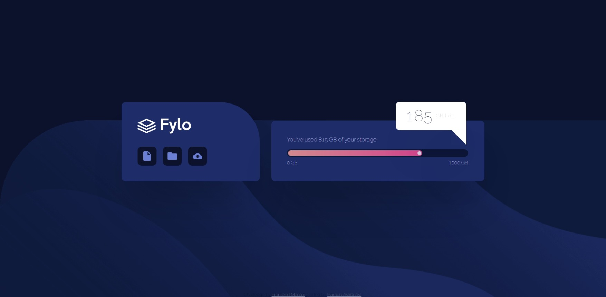

# Frontend Mentor - Fylo data storage component solution

This is a solution to the [Fylo data storage component challenge on Frontend Mentor](https://www.frontendmentor.io/challenges/fylo-data-storage-component-1dZPRbV5n). Frontend Mentor challenges help you improve your coding skills by building realistic projects. 

### The challenge

Users should be able to:
- View the optimal layout for the site depending on their device's screen size

### Screenshot

### Links

- Live Site URL: [Fylo data storage](https://hamed3958.github.io/Fyl-data-storage/)

### Built with
- Semantic HTML5 markup
- CSS custom properties
- Flexbox

## Author
- Website - [hamedasadiasl.ir](http://hamedasadiasl.ir/)
- Github - [@hamed3958](https://github.com/hamed3958)
- Frontend Mentor - [@hamed3958](https://www.frontendmentor.io/profile/hamed3958)
